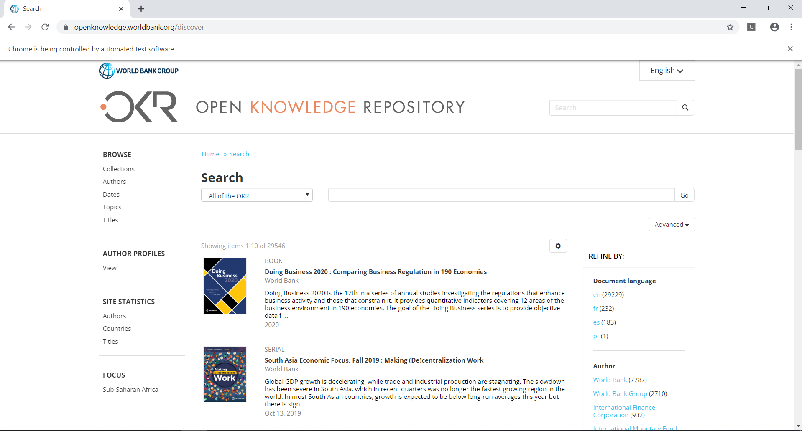
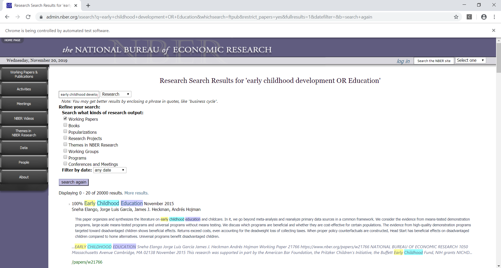
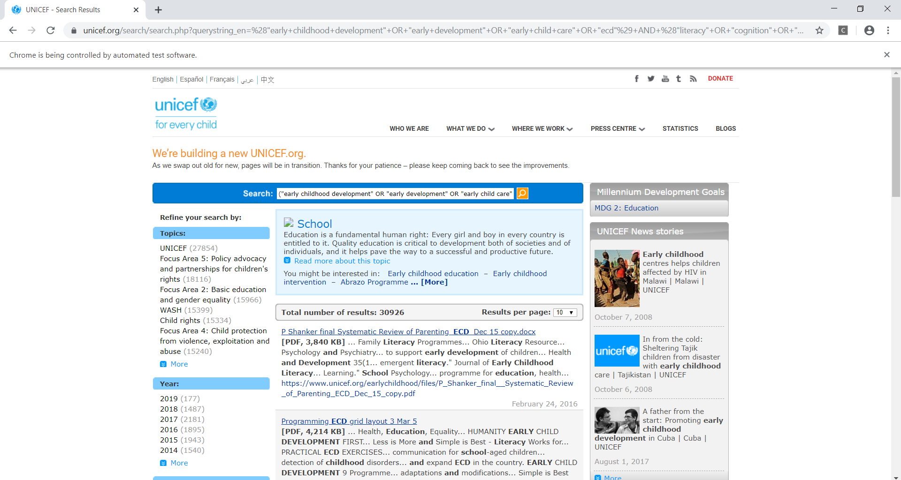

# Early Childhood Research Web Scraping

## Objective:
This is a data project for a literature research at University of San Francisco.  The study focuses on the literatures on Early Childhood research papers.  In this project, we are creating Python application to scrap the Early Childhood Research Papers (+50,000) from different institution web sites, such as NBER, World Bank database, and UNICEF.

## Tools:
The project is performed using Python libraries.
- splinter
- BeautifulSoup
- pandas
- time
- random

## Results:
The application should return +50,000 results with each research paper title, summary, citation, link, publish date, and author.

## Challenges:
The NBER web page is only limited to the first 20 pages search.  It doesn't allow the autobot to go beyond 20 pages search.  Random timers and manual search were tested, but both failed to go beyond the limit.  
